# Architecture & Decisions — Agent Debate

**Project:** `agent_debate` · **Status:** Living doc · **Last updated:** 2026-05-31
**Audience:** a new team member who wants to understand the design **without
reading all the code first.**

This is the map. It explains *what the system is*, *how the five packages fit
together*, *the key mechanisms*, and — most usefully for a newcomer — *the
decisions we made and why*. It summarises and **links** the deeper docs rather
than duplicating them:

- [`PRD.md`](PRD.md) — product vision, goals, full architecture (§5), surfaces,
  configuration (§7), acceptance criteria (§11).
- Sub-PRDs in [`prds/`](prds/): [debate orchestration](prds/debate-orchestration.md),
  [anti-sycophancy](prds/anti-sycophancy.md), [API gatekeeper](prds/api-gatekeeper.md),
  [search plug-in](prds/search-plugin.md).
- Per-package READMEs: [core/SDK](../packages/core/README.md),
  [cli](../packages/cli/README.md), [api](../packages/api/README.md),
  [ui](../packages/ui/README.md), [log](../packages/log/README.md).
- [`UI.md`](UI.md) — the web UI layout + UX walkthrough.

---

## 1. System overview

Two debate agents argue opposite sides of one topic — **Pro** (for) and **Con**
(against) — across a fixed number of rounds (default 10 each). A third
**Controller** agent moderates: it assigns the sides, keeps each debater on
track, and at the end writes a summary, an agree/disagree result, and a verdict
on **who won**.

The object of interest is **the debate itself** — whether the agents genuinely
engage and rebut — **not** fact-checking. We never verify the truth of claims.

The defining technical risk we engineer against is **sycophancy**: LLMs are
trained to be agreeable and drift toward the last speaker. The whole
anti-sycophancy design (§4.1) exists to stop either debater from "controlling"
the other and to let the Controller nudge a captured agent back onto its side.

### The three-agent model and orchestration flow

```
            topic
              │
              ▼
        ┌───────────┐   assigns sides (privately), never reveals own stance
        │ Controller│───────────────────────────────────────────────┐
        └───────────┘                                                 │
              │ moderates + RELAYS each turn (drift-check, then        │
              │ frames & forwards the message: child→father→child)     │
   ┌──────────┴───────────┐                                           │
   ▼                      ▼                                           ▼
┌──────┐  via Controller ┌──────┐                               ┌───────────┐
│ Pro  │── adversarial ──│ Con  │   round = 1..ROUNDS           │  Verdict  │
│agent │   relay through │agent │   Pro msg → drift → forward    │ summary + │
└──────┘   the father    └──────┘   Con msg → drift → forward    │ winner +  │
   │       (separate          │       (each ≤ MAX_WORDS)          │ converged │
   │        contexts)         │                                   │           │
   └─── tools: web_search, build_argument, analyze_opponent ──▶ └───────────┘
              every external call ▼
                        ┌──────────────────┐
                        │  API gatekeeper  │  rate-limit + FIFO queue + retry
                        └──────────────────┘
                                  │
                     LLM provider / SearchProvider
```

Flow (full detail in [`prds/debate-orchestration.md`](prds/debate-orchestration.md)
and `engine/loop.py`'s docstring):

1. **Setup** — the Controller receives/sets the topic, privately assigns Pro =
   FOR and Con = AGAINST, and hides its own stance
   (`engine/setup.py::setup_debate`, topic validated by the security gatekeeper).
2. **Debate loop** — for `round = 1..ROUNDS` (default 10), alternating:
   Pro turn → Controller drift-check on Pro → **Controller forwards Pro → Con** →
   Con turn (rebuts the controller-forwarded frame) → Controller drift-check on Con
   → **Controller forwards Con → Pro** (next round). Every message flows
   **child → father → child** (HW2 §8.3.7): the Controller is the explicit relay
   hub — it frames + forwards each message (`engine/forward.py::forward_to_opponent`,
   reusing the §5.6 adversarial relay) and logs a `message_routed_through_controller`
   event, so the debaters never communicate directly. Each inter-agent hop is wrapped
   in a structured JSON `AgentMessage` envelope (`engine/message.py`,
   round/from_side/to_side/type/content — HW2 §8.3.8 monitorable JSON IPC): the
   envelope is the logged transport (under the routing event's `envelope` key) while
   the legible adversarial prompt the model sees is *rendered* from its `content`, so
   prompt legibility and debate quality are unchanged. Each message is `≤ MAX_WORDS`;
   a captured agent gets a private nudge that is **not** counted as a debate turn
   (`engine/loop.py::run_debate_loop`, `engine/turn.py`, `engine/drift.py`).
3. **Closing discussion** — a freer exchange before judgement
   (`engine/closing.py`), stored separately from the main transcript.
4. **Verdict** — the Controller writes summary + converged flag + result +
   winner + reasoning, judged on argumentation only
   (`skills/controller.py::render_verdict`, `engine/_verdict.py`).

Every model call is wrapped with a **timeout**; on timeout/transient error the
call is cancelled and **retried** up to `MAX_RETRIES`, then the turn is marked
failed gracefully (`engine/turn.py`). The result is a structured
`DebateResult` (transcript, tool calls, nudges, closing discussion, verdict,
token totals, cost breakdown).

### Class diagram (class layout & relationships)

The diagram below shows the **key classes** grouped by area and how they relate
(composition `*-->`, "uses/derives" `..>`, and structural protocol-implements
`..|>`). It is deliberately the load-bearing classes, not every type. All names
are verified against the code (paths in §3); the ISO/IEC 25010 mapping is §8.

```mermaid
classDiagram
    %% ── Engine / SDK (core/engine) ──────────────────────────────
    class DebateEngine {
        +config: DebateConfig
        +run(topic) DebateResult
        +stream(topic) Iterator
    }
    class DebateConfig {
        +rounds: int
        +max_words: int
        +pro_model: str
        +con_model: str
        +budget_usd: float
        +from_settings(settings)$ DebateConfig
    }
    class DebateSetup {
        +topic: str
        +pro_agent / con_agent / controller_agent
    }
    class DebateResult {
        +topic: str
        +transcript: list~DebateMessage~
        +nudges: list~NudgeMessage~
        +verdict: Verdict
        +totals: CostTotals
        +cost_breakdown: CostBreakdown
    }
    class DebateMessage
    class CostTotals
    class AgentMessage {
        +round / from_side / to_side / content
        +render() str
    }
    class Gatekeeper {
        <<protocol>>
        +execute(api_call, *, service) result
    }

    %% ── Agents / contexts (core/agents) ─────────────────────────
    class AgentContext {
        +identity: str
        +system_prompt: str
        +append_user() / append_assistant()
        +message_history() list
    }
    class Turn {
        +role: str
        +content: str
    }
    class DebateContexts {
        +pro / con / controller: AgentContext
    }

    %% ── Gatekeepers (core/gatekeeper, core/security) ────────────
    class ApiGatekeeper {
        +execute(api_call, *, service)
        +drain() int
        +get_status() GatekeeperStatus
    }
    class RateLimitConfig {
        +services: dict~str,ServiceLimits~
    }
    class ServiceLimits
    class QueueFullError
    class SecurityGatekeeper {
        +sanitize(text) str
    }

    %% ── Search (core/search) ────────────────────────────────────
    class SearchProvider {
        <<protocol>>
        +name: str
        +search(query) list~SearchResult~
    }
    class SearchResult
    class DuckDuckGoSearchProvider
    class TavilySearchProvider
    class GatekeptSearchProvider
    class ResilientSearchProvider

    %% ── Pricing / cost (core/pricing) ───────────────────────────
    class PriceTable {
        +get_model_price(model) ModelPrice
    }
    class CostBreakdown {
        +rows: list~ModelCostRow~
    }
    class ModelCostRow
    class BudgetStatus

    %% ── Watchdog + LOG (core/watchdog, log) ─────────────────────
    class Watchdog {
        +run(max_ticks) WatchdogResult
    }
    class WatchdogConfig
    class LogEvent {
        +run_id / round / agent / event_type / payload
    }
    class EventSink {
        <<protocol>>
        +__call__(event)
    }
    class RotatingJsonlSink {
        +write(line)
    }
    class RotationConfig

    %% ── Skills (core/skills) ────────────────────────────────────
    class DebateSide {
        <<enum>>
        PRO
        CON
    }
    class Verdict
    class NudgeMessage

    %% relationships
    DebateEngine *--> DebateConfig
    DebateEngine ..> DebateSetup : builds via setup_debate
    DebateEngine ..> DebateResult : returns
    DebateEngine o--> Gatekeeper : routes calls
    DebateSetup *--> DebateContexts
    DebateContexts *--> AgentContext
    AgentContext *--> Turn
    DebateResult *--> DebateMessage
    DebateResult *--> CostTotals
    DebateResult *--> Verdict
    DebateResult *--> NudgeMessage
    DebateResult *--> CostBreakdown
    AgentMessage ..> DebateSide
    AgentMessage ..> SecurityGatekeeper : sanitises content

    ApiGatekeeper ..|> Gatekeeper
    ApiGatekeeper *--> RateLimitConfig
    RateLimitConfig *--> ServiceLimits
    ApiGatekeeper ..> QueueFullError : raises
    ApiGatekeeper ..> LogEvent : logs

    DuckDuckGoSearchProvider ..|> SearchProvider
    TavilySearchProvider ..|> SearchProvider
    GatekeptSearchProvider ..|> SearchProvider
    ResilientSearchProvider ..|> SearchProvider
    GatekeptSearchProvider o--> SearchProvider : wraps
    ResilientSearchProvider o--> SearchProvider : wraps
    GatekeptSearchProvider o--> Gatekeeper : routes search
    SearchProvider ..> SearchResult : returns

    CostBreakdown *--> ModelCostRow
    CostBreakdown ..> PriceTable : priced from
    BudgetStatus ..> CostBreakdown : checks total

    Watchdog *--> WatchdogConfig
    Watchdog ..> LogEvent : emits
    RotatingJsonlSink *--> RotationConfig
    EventSink ..> LogEvent : receives
    Verdict *--> DebateSide
    NudgeMessage *--> DebateSide
```



**Reading the diagram.** `DebateEngine` is the SDK facade: it *owns* a
`DebateConfig`, builds a `DebateSetup` (which owns the three isolated
`AgentContext`s via `DebateContexts`, each a list of `Turn`s — the
anti-sycophancy "separate threads" property, §4.1), and returns a `DebateResult`
that *composes* the transcript (`DebateMessage`), `nudges` (`NudgeMessage`),
`verdict` (`Verdict`), `totals` (`CostTotals`) and `cost_breakdown`
(`CostBreakdown`). Every external call routes through the `Gatekeeper` protocol;
`ApiGatekeeper` is the concrete implementer (composing `RateLimitConfig` →
`ServiceLimits`, raising `QueueFullError` on backpressure). Inter-agent hops are
carried by `AgentMessage`, which sanitises its content through the
`SecurityGatekeeper`. Search is a swappable plug-in: `SearchProvider` is a
structural protocol implemented by `DuckDuckGoSearchProvider`,
`TavilySearchProvider` and the two transparent decorators
`GatekeptSearchProvider` (routes through the `Gatekeeper`) and
`ResilientSearchProvider` (timeout/retry), all returning `SearchResult`s.
Pricing turns tokens into a `CostBreakdown` (`ModelCostRow`s) using the
`PriceTable`, checked against a `BudgetStatus`. `Watchdog` (driven by
`WatchdogConfig`) and the LOG layer — `LogEvent`, the `EventSink` protocol and
the FIFO-rotating `RotatingJsonlSink` (`RotationConfig`) — provide liveness and
observability. `DebateSide` (the `pro`/`con` enum) is the shared key threaded
through verdicts, nudges and per-side cost rows.

---

## 2. The five packages (uv workspace)

The repo is a **`uv` workspace** of PEP 420 namespace packages under
`packages/`. Each is one of the five required surfaces. The dependency
direction is strictly one-way — **core is the heart; LOG is shared; API/CLI/UI
are thin shells:**

```
        ┌──────┐   ┌──────┐   ┌──────┐
        │ CLI  │   │ API  │◀──│  UI  │      (thin shells over the SDK / API)
        └──┬───┘   └──┬───┘   └──┬───┘
           │          │          │
           ▼          ▼          ▼
        ┌──────────────────────────┐
        │     core  (SDK / engine) │            ← the heart
        └────────────┬─────────────┘
                     ▼
        ┌──────────────────────────┐
        │           log            │            ← shared by everyone, depends on nothing
        └──────────────────────────┘
```

| Package | Module | Responsibility | Depends on |
| --- | --- | --- | --- |
| **SDK / core** | `agent_debate.core` | The engine, the Pro/Con/Controller agents + skills, the anti-sycophancy logic, the **API gatekeeper**, the **security gatekeeper**, the pluggable **search providers**, and **pricing/cost**. All real logic lives here. Facade: `DebateEngine(config).run(topic)` / `.stream(topic)`. | `log` |
| **CLI** | `agent_debate.cli` | A [Typer](https://typer.tiangolo.com/) terminal app (`agent-debate run "<topic>"`) that drives the SDK and renders the live transcript + verdict; `--json` for machine output. | `core`, `log` |
| **API** | `agent_debate.api` | A [FastAPI](https://fastapi.tiangolo.com/) shell: `POST /debates`, `GET /debates/{id}`, `GET /debates/{id}/stream` (SSE). Schedules a run on the SDK in the background. | `core`, `log` |
| **UI** | `agent_debate.ui` | A small FastAPI app serving a static single-page web frontend over the **API** (live Pro/Con panels, moderator actions, system log, verdict). No build step. | `core`, `log` (talks to the API over HTTP at runtime) |
| **LOG** | `agent_debate.log` | The shared logging surface: [structlog](https://www.structlog.org/) setup, the typed `LogEvent` schema + allowed `event_type` set, cost/token fields, secret **redaction**, and the live event-stream sinks. Depends on nothing in the workspace. | — |

Why this layout: it satisfies the guideline's "all logic in the SDK, no
duplication" rule (the surfaces hold zero business logic) and keeps LOG a leaf
dependency every package can use without cycles. See each package's README for
its public API and a minimal example.

> **≤150 lines per file** (guideline §3.2) is why `core` is split into many
> small single-responsibility modules — e.g. `engine/` holds `loop.py`,
> `turn.py`, `setup.py`, `drift.py`, `closing.py`, `stream.py`, `models.py`,
> `result.py`, `sdk.py`; the gatekeeper splits into `_limiter.py`, `_queue.py`,
> `_retry.py`, `_gatekeeper.py`. We **split, never compress.**

---

## 3. Where to look (code map)

| You want to understand… | Start at |
| --- | --- |
| The public SDK entrypoint | `packages/core/src/agent_debate/core/engine/sdk.py` (`DebateEngine`) |
| The 10-vs-10 loop | `core/engine/loop.py` (`run_debate_loop`) |
| One turn (timeout/retry, word limit) | `core/engine/turn.py` |
| The agents | `core/agents/debater.py`, `core/agents/controller.py` |
| Skills (tools) | `core/skills/` (`web_search`, `build_argument`, `analyze_opponent`, `controller`) |
| Anti-sycophancy | `core/agents/relay.py`, `core/agents/anchoring.py`, `core/agents/context.py`, `core/engine/drift.py` |
| API gatekeeper | `core/gatekeeper/` (`_gatekeeper.py`, `_limiter.py`, `_queue.py`, `_retry.py`, `config.py`) |
| Security gatekeeper | `core/security/` (`sanitiser.py`, `validation.py`, `normalise.py`) |
| Search plug-ins | `core/search/` (`base.py`, `registry.py`, `duckduckgo.py`, `tavily.py`, `gatekept.py`, `resilient.py`) |
| Pricing / cost / budget | `core/pricing/` (`breakdown.py`, `config.py`, `budget.py`, `_format.py`) |
| Logging | `packages/log/src/agent_debate/log/` (`event.py`, `_setup.py`, `redaction.py`, `_stream.py`) |

---

## 4. Key mechanisms

### 4.1 Anti-sycophancy / "no agent controls the other"

This is the project's core mechanism — full design in
[`prds/anti-sycophancy.md`](prds/anti-sycophancy.md). Four parts:

- **Separate contexts + adversarial relay.** The two debaters never share a chat
  thread; each has its own `AgentContext` (`core/agents/context.py`). The
  opponent's message is injected adversarially — *"Your opponent argued: «…».
  Rebut it."* — via `build_adversarial_relay` (`core/agents/relay.py`), not as
  an agreeable peer turn.
- **Side anchoring every turn.** Each turn re-states the agent's assigned side
  and an explicit "do not concede merely because the opponent is convincing"
  instruction (`core/agents/anchoring.py::anchor_turn` / `build_side_anchor`).
- **Controller drift detection.** After each message the Controller runs
  `assess_drift` (`core/skills/controller.py`, logic in
  `core/skills/_drift_logic.py`): is the agent still defending its side or
  starting to agree with / restate the opponent? It returns
  `{captured, reason, confidence}`.
- **Private nudge.** If captured, the Controller injects a private correction
  into the *captured agent's own context* (never the opponent's, never the
  public transcript). It is logged + streamed but is **not** a debate turn, so
  the 10-vs-10 invariant holds (`core/engine/drift.py`).
- **Cross-provider option.** Roles may use different models to reduce collusion
  (config-driven via `PRO_MODEL` / `CON_MODEL`; default same provider).

### 4.2 API gatekeeper (rate limit + FIFO overflow queue + retry)

A single chokepoint every **external** call — LLM provider **and** search
provider — passes through; **no code makes a direct external call that bypasses
it** (test-enforced in `core/tests/test_no_bypass.py`). Full design in
[`prds/api-gatekeeper.md`](prds/api-gatekeeper.md).

- `ApiGatekeeper.execute(api_call, ...)` (`core/gatekeeper/_gatekeeper.py`):
  **check** the sliding-window rate limit (`_limiter.py`) → if exhausted,
  **enqueue** into a bounded per-service **FIFO** overflow queue (`_queue.py`)
  rather than drop/crash; a genuinely full queue raises `QueueFullError`
  (backpressure). `drain()` runs queued calls as windows reset.
- **Retries** on transient failures with backoff (`_retry.py`).
- **Every call is logged** (service, latency, outcome) via the LOG package;
  `get_queue_status()` reports depth + stats.
- **Limits come from config, not code** — `config/rate_limits.json` (versioned,
  per-service `requests_per_minute` / `_per_hour` / `concurrent_max` /
  `retry_after_seconds` / `max_retries`), loaded by `load_rate_limit_config`.

### 4.3 Security gatekeeper (sanitisation + input validation)

Distinct from the API gatekeeper — this one guards **trust boundaries**, not
throughput (`core/security/`). All external text — the user topic, **web-search
results**, and model output — passes through `sanitize_untrusted_text`
(`security/sanitiser.py`) before re-entering a prompt: NFKC normalise + strip
control/zero-width chars (`normalise.py`), neutralise known injection phrasings,
and length-cap to bound the blast radius. Tool inputs are validated with
Pydantic models (`validate_topic`, `validate_search_query` in
`security/validation.py`); there is **no arbitrary code execution from model
output** (`core/tests/test_no_code_execution.py`). Secrets live only in `.env`
(git-ignored) and a CI secret scan fails on a committed key-like string.

### 4.4 Pluggable search providers

Web search is a **MUST**, but the vendor is **swappable with one config value**
(`SEARCH_BACKEND`) — full design in [`prds/search-plugin.md`](prds/search-plugin.md).
Providers implement the `SearchProvider` protocol returning a uniform
`SearchResult` (`core/search/base.py`) and register under a name via
`@register_search_provider`. `create_search_provider(settings, ...)`
(`core/search/registry.py`) is a pure registry lookup — adding a backend never
edits the factory. Default: `DuckDuckGoSearchProvider` (free, no key); a
`TavilySearchProvider` is included as a drop-in. Each provider is wrapped by
`GatekeptSearchProvider` (routes through the API gatekeeper) and
`ResilientSearchProvider` (timeout + retry + graceful empty-result handling).

### 4.5 Timeout + retry (kill and recall)

Every model call in a turn is wrapped with `TURN_TIMEOUT_S`; on timeout or a
transient error the call is cancelled and retried up to `MAX_RETRIES` with
backoff (`core/engine/turn.py`, `core/engine/_call.py`). After exhaustion the
turn is recorded as **failed** (not crashed) and the opponent gets a fresh
anchor rather than a failure marker — the graceful-degradation policy.

### 4.6 Structured logging

LOG is the single source of truth for observability (`packages/log`). Every
event is a validated `LogEvent` carrying `run_id`, `round`, `agent`,
`event_type` (`message | tool_call | nudge | timeout | retry | verdict |
system`), `tokens`, `latency_ms`. Two sinks: a pretty console renderer (dev) and
a per-run JSONL file at `runs/<run_id>/<run_id>.jsonl`. A redaction processor strips
secret-like values before either sink. The engine's `.stream()` fans the same
events through live `EventSink`s for the CLI/API/UI.

### 4.7 Cost / pricing + budget cap

Per-turn tokens fold into `DebateMessage` → `CostTotals` (`core/engine/result.py`,
`_usage.py`). A config-driven per-model price table
(`config/model_prices.json`, loaded by `load_price_table`) converts tokens to
USD: `cost_breakdown_from_result` builds a per-model `CostBreakdown`
(`ModelCostRow` rows + an overall total), and `format_cost_table` renders the
markdown table (`core/pricing/`). A configurable per-run cap, `BUDGET_USD`
(`0` = unlimited), is checked by `check_budget`; an overrun emits a structured
over-budget `system` alert into the run log (`core/pricing/budget.py`,
`_alert.py`). See [`PRD.md`](PRD.md) §10.

---

## 5. Configuration & versioning

Nothing operational is hard-coded. Runtime behaviour is read from the
environment / `.env` via `Settings` / `get_settings()` (pydantic-settings,
`core/settings.py`); rate limits live in `config/rate_limits.json` and prices in
`config/model_prices.json`. The key variables (`ANTHROPIC_API_KEY`,
`DEBATER_MODEL`, `CONTROLLER_MODEL`, `PRO_MODEL`/`CON_MODEL`, `ROUNDS`,
`MAX_WORDS`, `TURN_TIMEOUT_S`, `MAX_RETRIES`, `SEARCH_BACKEND`, `BUDGET_USD`) are
documented in [`PRD.md`](PRD.md) §7 and `.env.example`. The SDK version starts at
`1.00` and is defined in exactly one place (`core/_version.py`).

---

## 6. Key decisions / rationale (ADR-style)

Each row: **decision → why → trade-off.**

| # | Decision | Why | Trade-off |
| --- | --- | --- | --- |
| D1 | **Pydantic AI** as the LLM abstraction | Provider-agnostic — swap models by changing a config string, no ecosystem lock-in; typed agents + first-class tool calling for skills. | An extra abstraction layer over raw provider SDKs; bound to Pydantic AI's release cadence. |
| D2 | **Separate contexts + adversarial relay** for the debaters (not a shared thread) | Directly counters sycophancy — a model in a shared thread concedes to the last speaker; framing the opponent as an adversary to rebut keeps each agent on its side. | More prompt plumbing and re-sent context per turn (higher input-token cost — see PRD §10). |
| D3 | **Controller drift-detection + private nudge** | "No agent controls the other" is a hard requirement; the moderator catches capture and corrects it without polluting the transcript or counting as a turn. | Extra model calls per round; depends on the drift heuristic's quality. |
| D4 | **One API gatekeeper for ALL external calls** | Centralises rate-limiting, FIFO overflow queueing, retries, and per-call logging in one auditable chokepoint; "never drop/crash". | Every call path must route through it (enforced by a no-bypass test); a single component to keep correct. |
| D5 | **Security gatekeeper separate from the API gatekeeper** | They solve different problems — trust-boundary sanitisation vs. rate/throughput; keeping them separate keeps each small and single-purpose. | Two "gatekeepers" can confuse newcomers (hence this doc spells out the distinction). |
| D6 | **Pluggable `SearchProvider` behind a stable protocol + registry** | Web search is mandatory but vendors differ; a one-line `SEARCH_BACKEND` swap with no engine edits keeps us free of any single search vendor. | A thin indirection layer; each provider must honour the uniform `SearchResult` contract. |
| D7 | **Five-package workspace; all logic in `core`; surfaces are thin** | Matches the required surfaces (SDK/CLI/API/UI/LOG), prevents duplicated business logic, and gives a clean one-way dependency graph. | More packaging overhead than a single module; surfaces must resist sneaking logic in. |
| D8 | **LOG as a shared leaf package** | Every surface needs consistent structured logs + redaction; a leaf dependency avoids cycles and gives one event schema. | All packages couple to LOG's `LogEvent` schema — schema changes ripple. |
| D9 | **Config-driven everything (`Settings` + JSON config files), `0` hard-coded values** | Guideline §7.2; lets behaviour, limits, and prices change without code edits and keeps secrets out of the repo. | Indirection — you must read config files to know effective behaviour. |
| D10 | **≤150 lines per file; split don't compress** | Guideline §3.2; small single-responsibility modules are easier to read, test, and review. | Many files and `_private` helper modules; more imports to follow. |
| D11 | **TDD + ≥85% coverage gate + ruff/mypy in CI** | Quality is enforced mechanically, not by hope; regressions fail the build. | Up-front test cost; the coverage gate can block merges until covered. |
| D12 | **No fact-checking — judge argument quality only** | The research question is whether agents engage and converge, not whether claims are true; fact-checking is out of scope (PRD §3). | Verdicts reward rhetoric/rebuttal, not correctness — by design, not accident. |

---

## 7. Quality standards (how we work)

Hard requirements from the lecturer's guidelines, adopted explicitly (full list
in [`PRD.md`](PRD.md) §8): **TDD** (Red→Green→Refactor — failing test first),
**coverage ≥ 85%** (`fail_under = 85`), **≤150 lines per code file** (CI check
`scripts/check_line_limit.py`), **ruff = 0 violations + mypy clean**, **no
hard-coded values**, **no secrets in the repo** (CI secret scan), and **every
external call through the API gatekeeper**. Run the gate locally before a PR —
see the [root README](../README.md) "Contributing & quality gates".

---

## 8. ISO/IEC 25010 product-quality mapping

The lecturer's guidelines (§13) require the system to be mapped to the
[ISO/IEC 25010](https://iso25000.com/index.php/en/iso-25000-standards/iso-25010)
product-quality characteristics. Each row names the characteristic and **how
this system concretely addresses it**, citing the real mechanism/module (all
verified against the tree — see §3 for the code map). Referenced from
[`PRD.md`](PRD.md) §8/§13.

| Characteristic | How this system addresses it (real mechanisms) |
| --- | --- |
| **Functional suitability** | The mandated debate behaviour is implemented and **acceptance-tested**: a full 10-vs-10 alternating loop (`engine/loop.py::run_debate_loop`), debaters that *rebut* via the adversarial relay (`agents/relay.py`), each turn within `MAX_WORDS` (`engine/turn.py`), web search as a skill (`skills/web_search`), and a Controller that produces summary + agree/disagree + winner (`skills/controller.py::render_verdict`). PRD §11 acceptance criteria are covered by `tests/` (Epic 12.1). |
| **Performance efficiency** | **Async concurrency** throughout — turns, model calls, and searches are `async`; the API gatekeeper bounds parallelism with a config-driven `concurrent_max` (`config/rate_limits.json`, `gatekeeper/_limiter.py`) and a sliding-window rate limit so the system uses capacity without overrunning provider limits. Token/latency are accounted per turn (`engine/_usage.py`) and cost scales predictably with `ROUNDS`/`MAX_WORDS` (PRD §10). |
| **Compatibility** | Five-package `uv` workspace with a strict one-way dependency graph (§2) — `core` is the heart, `LOG` a shared leaf, CLI/API/UI thin shells; **no business logic duplicated** across surfaces (no co-existence conflicts). Interop is over stable contracts: the `DebateEngine` facade, the FastAPI HTTP/SSE API, and the typed `LogEvent` schema the UI/CLI consume identically. |
| **Usability** | The web UI is designed and documented against **Nielsen's 10 heuristics** ([`UI.md`](UI.md), task 11.6) — always-honest status line (#1), cancel/user-control (#3), error prevention/recovery (#5, #9), minimalist help (#10) — plus **RTL** support (task 11.5). The CLI renders a live transcript and offers `--json` for machine use. |
| **Reliability** | **Fault tolerance by design.** Every external call is wrapped with a **timeout + retry** with backoff (`engine/turn.py`, `engine/_call.py`, `gatekeeper/_retry.py`, up to `MAX_RETRIES`); an exhausted turn is recorded as *failed*, never crashes the run (graceful degradation, §4.5). The API gatekeeper **never drops** an over-limit call — it enqueues into a bounded per-service FIFO **overflow queue** and drains as windows reset (`gatekeeper/_queue.py`), raising `QueueFullError` only as explicit backpressure. Search is wrapped by `search/resilient.py` (timeout + retry + empty-result fallback). |
| **Security** | **Two gatekeepers + no secrets.** The **security gatekeeper** sanitises all untrusted text — topic, web-search results, model output — before it re-enters a prompt (`security/sanitiser.py`: NFKC normalise, strip control/zero-width chars, neutralise injection phrasings, length-cap) and validates tool inputs with Pydantic (`security/validation.py`); **no code execution from model output** (test-enforced, `tests/test_no_code_execution.py`). The **API gatekeeper** is the sole audited egress point. Secrets live only in git-ignored `.env`, are **redacted** from logs (`log/redaction.py`), and a CI secret scan fails on committed key-like strings. |
| **Maintainability** | Enforced **mechanically**, not by convention: **≤150 lines per code file** (CI `scripts/check_line_limit.py` — "split, don't compress", §2), **ruff = 0 violations + mypy clean**, **TDD** (failing test first) with a **≥85% coverage gate** (`fail_under = 85`). SDK-centric architecture with **no duplication** (all logic in `core`, surfaces are thin), config-driven behaviour (no hard-coded values), and public APIs documented with Google-style docstrings (task 12.4a). The ADR-style decisions table (§6) records the *why*. |
| **Portability** | **No vendor lock-in.** [Pydantic AI](https://ai.pydantic.dev/) abstracts the LLM provider — swap models with a config string (D1); search vendors are **pluggable** behind the `SearchProvider` protocol + registry (one-line `SEARCH_BACKEND` swap, no engine edits — §4.4). The project is a portable `uv` workspace (`pyproject.toml` as single source of truth, pinned Python, no `requirements.txt`); all operational settings come from the environment/`.env` + JSON config (§5), so it relocates across machines without code changes. |

## 9. See also

- [`PRD.md`](PRD.md) — the full product/architecture spec (§5 is the long form
  of §1–§4 here).
- Sub-PRDs: [debate orchestration](prds/debate-orchestration.md) ·
  [anti-sycophancy](prds/anti-sycophancy.md) ·
  [API gatekeeper](prds/api-gatekeeper.md) · [search plug-in](prds/search-plugin.md).
- Package READMEs: [core](../packages/core/README.md) ·
  [cli](../packages/cli/README.md) · [api](../packages/api/README.md) ·
  [ui](../packages/ui/README.md) · [log](../packages/log/README.md).
- [`UI.md`](UI.md) · [`TASKS.md`](TASKS.md) · [`PROMPTS.md`](PROMPTS.md).
