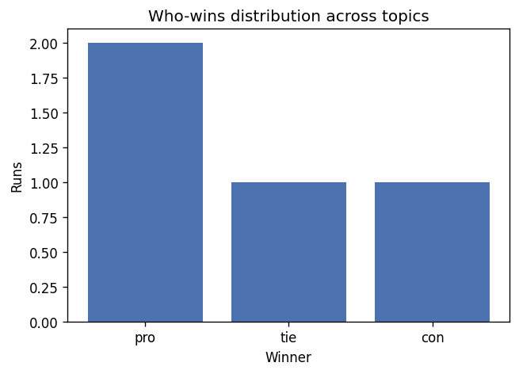
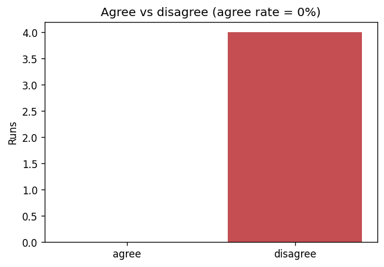
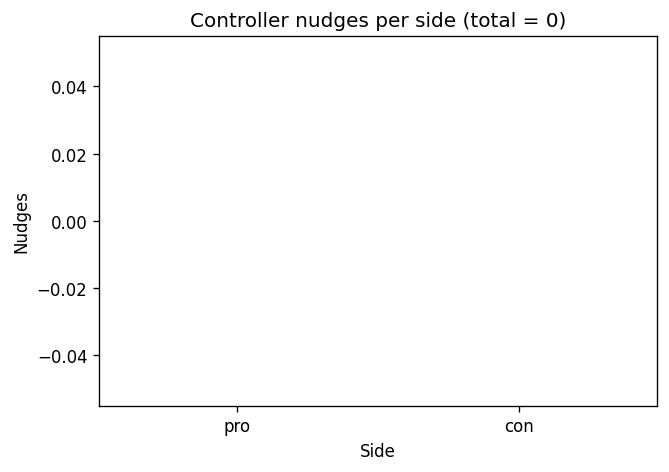
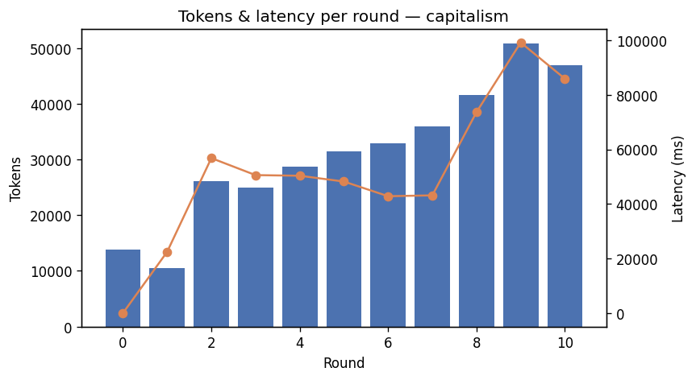

# Debate results — interpreted visualizations (PRD §9, task 14.3)

These charts visualize the four PRD §9 analyses over the committed sample runs
(`runs/dataset/runs_summary.csv`, **n = 4** debates). They are regenerated from
the durable `runs/<run_id>.jsonl` logs by reusing the 14.2 analysis functions
(`agent_debate.core.research.analysis`) — no aggregation is re-implemented here.

Regenerate with the `viz` extra (matplotlib):

```bash
uv sync --group viz
uv run --group viz python scripts/generate_figures.py
```

PRD §9 asks for *interpretation*, not just numbers, with an eye on whether the
anti-sycophancy design holds. Each chart below is read in that light. The sample
is small (n = 4), so these are illustrative trends, not statistical claims.

## 1. Who-wins distribution



Verdicts split **pro = 2, con = 1, tie = 1** across the four topics. There is no
runaway winner: the controller's verdict is not anchored to one side, and a tie
is a reachable outcome. This is what we want from an adversarial judge — neither
debater is structurally favoured, which is consistent with the side-anchoring +
independent-context design (§5) doing its job rather than one persona dominating.

## 2. Agree vs disagree



**0 % convergence** — every run ended in disagreement (`converged = False`).
This is the *expected* result for an adversarial debate format: Pro and Con are
anchored to opposing sides and instructed not to capitulate, so genuine agreement
should be rare. A high agree rate here would be a red flag for sycophancy/capture
(one side rolling over). Zero convergence is therefore evidence the format is
holding the adversarial tension it was designed for, not a defect.

## 3. Controller nudges per side (anti-sycophancy evidence)



**0 nudges on both sides, every run.** The controller's drift/nudge mechanism
(§8) corrects a debater that gets captured by its opponent and abandons its
assigned side. Across these four runs it never had to intervene: the side anchors
held on their own. That is the headline anti-sycophancy result — the design keeps
each agent on-side *without* needing the safety net. This does not mean the nudge
path is untested: the staged-drift detection/correction logic is exercised
directly by the engine tests (task 8.4); here the real runs simply did not trip
it. With n = 4 we read this as "the anchoring is robust on these topics", not as
proof the controller never nudges.

## 4. Tokens & latency per round



For the longest debate (`capitalism`, 10 rounds), per-round **tokens rise from
~14k in round 0 to ~51k by round 9**, with latency tracking it (round 0 ≈ near
zero to round 9 ≈ 99 s). The growth is the cost signature PRD §10 predicts:
every turn re-sends the side anchor plus the adversarial relay of the opponent's
last message *and* the lengthening transcript, so input tokens grow faster than
linearly in round count. The practical implication is direct — **cost scales
super-linearly with `ROUNDS`**, so lowering `ROUNDS`/`MAX_WORDS` (or routing
debaters to a cheaper model) is the cheapest lever, and a `BUDGET_USD` cap flags
a runaway long debate early. This is why the 10-round capitalism run cost ~$1.03
versus ~$0.20 for the 3-round runs.
