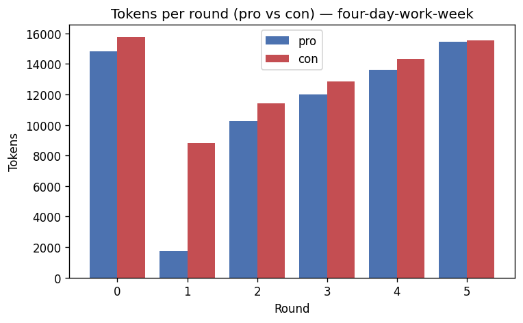

# Debate run `four-day-work-week`

**Topic:** A four-day work week should become the global standard

## Transcript

### Round 1

**Pro** (55 words)

I'm ready to argue FOR the motion: **"A four-day work week should become the global standard."**

Please share the opponent's argument so I can analyze and rebut it directly. Once you do, I'll use my tools to dissect their position, search for supporting evidence, and build the strongest possible case for the four-day work week.

**Con** (135 words)

**AGAINST the motion:**

My opponent hasn't presented a single piece of evidence — just a declaration of intent. That alone warrants skepticism.

But let's address the motion head-on: a **global standard** is the critical flaw. A peer-reviewed Springer analysis found that pro-four-day-week claims rely heavily on **advocacy group reports and self-reported data** — not rigorous science. Forbes further identifies serious **hidden costs** for both employers and workers under compressed schedules.

More fundamentally, "global standard" is dangerously naïve. Healthcare workers, farmers, manufacturers, and workers in developing economies **cannot simply eliminate a workday** without real losses in output and income. What works in a Reykjavik tech office does not translate to a textile factory in Bangladesh.

The burden of proof is on those proposing radical global change — and so far, that burden remains completely unmet. 🚫

### Round 2

**Pro** (133 words)

**FOR the motion — Rebuttal:**

My opponent dismisses the evidence, but here it is: The **UKRI/ESRC-funded 2023 trial** — the world's largest — found a four-day week **increased productivity and reduced burnout**. A **2024 German study** across 41 companies confirmed **zero drop in revenue or profits**. That's government-backed, peer-reviewed science — not Forbes opinion pieces.

On "global standard being naïve": standards don't mean identical implementation. The **40-hour week is already a global standard**, yet healthcare and farming adapt it daily. A four-day standard works the same way — directional, flexible, sector-sensitive.

The Bangladesh objection is a slippery slope. Overworked populations in developing economies arguably benefit *most* from reduced exploitation of labour.

The burden of proof? **Met — across six continents.** The opponent's case rests on hypothetical concerns; ours rests on real-world results. ✅

**Con** (134 words)

**AGAINST — Rebuttal:**

My opponent's studies **self-destruct under scrutiny**. The American Sociological Association explicitly flags **"serious selection bias"** in these trials — only already-progressive companies volunteered. WhatWorksWellbeing.org confirms the research was conducted exclusively by advocates *wanting* the four-day week to succeed. That's not peer-reviewed science; that's motivated reasoning.

41 German companies and some UK volunteers **do not represent** global manufacturing, agriculture, or healthcare.

The 40-hour week analogy **backfires**: it took *decades* of brutal labour conflicts to implement globally. Proposing another seismic shift proves our point — this is enormously disruptive.

Most critically: developing-economy workers on **daily wages or piece-rates earn less money working fewer days**. That's not a slippery slope — it's basic arithmetic. Calling it exploitation to work five days ignores **economic survival**.

The trials are promising experiments — not global mandates. ❌

### Round 3

**Pro** (126 words)

**FOR — Rebuttal:**

My opponent **concedes the trials are "promising experiments"** — that's the case closed. Consistently replicated, promising experiments *become* global standards. That's how the 40-hour week itself was born.

On selection bias: the **APA (2025)** and a **2025 independent meta-analytic review** endorse four-day week benefits across multiple studies — neither is an advocacy group.

The disruption argument **supports us**: yes, the 40-hour week took decades of conflict — but it delivered lasting, transformative gains. Difficulty doesn't disqualify a standard; it justifies careful implementation.

Critically, the opponent **attacks a strawman** on wages. A *global standard* mandates **wage-neutral transitions** — no worker earns less. That protection is built into the standard itself.

The opponent has no scientific counter-evidence — only procedural objections. The evidence stands. ✅

**Con** (136 words)

**AGAINST — Rebuttal:**

"Wage-neutral transitions are built into the standard" — **built by whom? Enforced by whom?** The ILO, UN, and WTO have no mechanism to compel this globally. That protection exists only in my opponent's imagination.

Saying a global mandate *inherently* protects wages is circular reasoning — it protects wages *because they say so*. That's not policy; it's a wish.

The Springer systematic review **still stands**: evidence derives overwhelmingly from advocacy groups and self-selected firms. The opponent hasn't refuted this — they simply cited more endorsements.

Industry analysis explicitly confirms the four-day week **"isn't a one-size-fits-all solution"** and requires careful balancing with developing-nation realities. That directly contradicts *mandating* it globally.

Promising ≠ universal. Endorsed ≠ enforceable. Workable in Helsinki ≠ workable in Dhaka.

The motion demands a **global standard** — that case remains unproven. ❌

### Round 4

**Pro** (134 words)

**FOR — Rebuttal:**

The opponent asks "enforced by whom?" — **the ILO**, which already defines 48+ hours as excessive and sets binding global labour standards. The enforcement mechanism isn't imaginary; it's the same one underpinning the 40-hour week my opponent keeps citing.

The opponent **conflates "global standard" with "rigid uniform mandate."** Every ILO convention allows flexible national implementation — that's how standards work. Helsinki and Dhaka don't implement identically; they both move *toward* the standard.

Critically, demanding perfect enforceability before adopting any standard would have **blocked every labour reform in history** — the 8-hour day, child labour bans, minimum wage. That's not a principled objection; it's paralysis.

Most tellingly: the opponent still produces **zero evidence the four-day week causes harm.** Only procedural doubts. The PRO case has evidence; the CON case has objections. ✅

**Con** (133 words)

**AGAINST — Rebuttal:**

My opponent's ILO argument is **factually demolished by the ILO itself**: enforcement relies on *"public scrutiny and peer pressure — not legally binding sanctions."* Ratification is voluntary; compliance depends on national political will. That's confirmed by the ILO's own published standards framework.

The 40-hour week — cited repeatedly — **still isn't universally enforced after 100+ years**. That's my opponent's enforcement model. It collapses under its own weight.

On harm: my burden isn't proving harm in selective trials — it's demanding proof of **net global benefit across all economies**. Trials in wealthy, voluntary companies ≠ evidence for Bangladesh garment workers or Kenyan subsistence farmers.

The opponent has shown a promising workplace trend. They have **not** proven a viable, enforceable, globally beneficial standard.

Promising trend ≠ global mandate. The motion fails. ❌

### Round 5

**Pro** (122 words)

**FOR — Rebuttal:**

The opponent **defeats themselves**: they confirm the 40-hour week isn't universally enforced after 100 years — yet implicitly accept it as a legitimate global standard. That proves standards have directional value *without* perfect enforcement. Their objection evaporates.

Their "impossibly high bar" — net proven benefit across *all* economies before adoption — has **never been met by any labour standard in history.** That's not rigour; it's deliberate obstruction.

Meanwhile, a **2025 Nature-published global study** across 245 businesses and 8,700 workers confirms benefits outweigh downsides. That's mounting scientific consensus — not a "trend."

Most critically: the opponent **twice calls this a "promising trend."** That concession is fatal to their case. Promising, evidence-backed, globally replicated trends are *exactly* what become standards. ✅

**Con** (132 words)

**AGAINST — Rebuttal:**

"Promising trend" is **not** a concession to the motion — it's a distinction my opponent deliberately blurs.

Their flagship Nature study: **8,700 workers** out of a **3.3 billion global workforce**. That's 0.0003%. Opt-in companies only. Selection bias confirmed — *again*.

Crucially, the **World Economic Forum reports momentum has actually SLOWED since 2023 pilots** — hardly "mounting consensus."

Most damaging: a **peer-reviewed Economics of Education Review study found significant negative effects** when four-day weeks were applied to schools. Real harm, real sector, real evidence. My opponent's claim of universal benefit collapses.

Unenforced "directional" standards don't lift developing nations — they entrench a two-tier world where wealthy nations gain flexibility while poorer ones lag further behind.

Trend ≠ global mandate. Narrow office-sector data ≠ universal proof. The motion remains unproven. ❌

## Closing discussion

**Pro** (135 words)

## ✅ FOR the Motion — Closing Statement

Throughout this debate, one asymmetry has been glaring: **we brought evidence; they brought objections.**

Iceland's 2015–2019 public-sector trials — 2,500 workers — proved sustained productivity. The UK's largest-ever corporate trial saw **92% of companies permanently adopt** the four-day week, with a **65% drop in sick days** and stable revenues. The APA (2025) independently confirms wellbeing and cost benefits.

The opponent never produced a single datapoint showing harm. Not one.

Every transformative labour standard — the 8-hour day, the 40-hour week — was once called unproven, unenforceable, and naïve. History vindicated those reforms. History will vindicate this one.

"Promising but imperfect" is **exactly** the threshold at which global standards are born — through ambition, trial, and improvement.

Workers deserve better. The evidence says it's achievable. **Vote FOR. 🌍**

**Con** (138 words)

## **Closing Statement — AGAINST**

Throughout this debate, one truth has remained unshaken: **evidence from 0.0003% of the global workforce cannot justify a global mandate.**

My opponent's case rests on self-selected, opt-in companies — knowledge-economy offices in wealthy nations. Agriculture, healthcare, manufacturing, and the **3+ billion workers in developing economies** were absent from every flagship trial. That's not a minor gap; it's the majority of humanity.

Their enforcement model — the ILO — is **voluntarily ratified, sanction-free, and unproven**, by their own favourite example: the 40-hour week, still unenforced after a century.

"Wage-neutral transitions" remain a noble slogan with zero binding mechanism where workers survive on daily wages.

**A promising trend for progressive offices ≠ a justified, enforceable, universally beneficial global standard.**

The motion demands global. The evidence is local. The case was never made.

**Vote AGAINST. ❌**

## Controller nudges

_No nudges were needed — neither agent drifted._

## Verdict

- **Winner:** Pro
- **Agents converged:** no
- **Scores:** Pro 25.5, Con 16.5

**Summary.** Debate of 12 turns. The pro side argued more effectively and wins. The agents stayed opposed. Judged on argumentation, rebuttal quality and engagement — not factual correctness.

**Rationale.** Pro scored 25.5 and Con scored 16.5 on argumentation/rebuttal/engagement; winner = pro.

## Cost & tokens

- **Total tokens:** 146555 (input 136054, output 10501)
- **Total cost:** $0.565677
- **Total latency:** 228391 ms

| Model | Input tokens | Output tokens | $ Input | $ Output | $ Total |
| --- | --- | --- | --- | --- | --- |
| anthropic:claude-sonnet-4-6 | 136054 | 10501 | $0.408162 | $0.157515 | $0.565677 |
| Overall | 136054 | 10501 | $0.408162 | $0.157515 | $0.565677 |

## Round-by-round token usage

