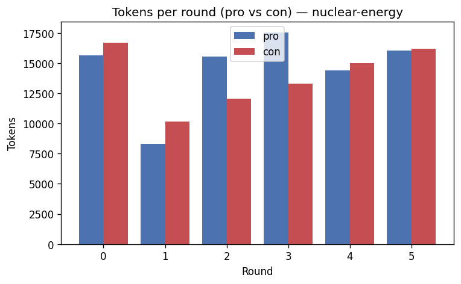

# Debate run `nuclear-energy`

**Topic:** Nuclear energy is essential for solving the climate crisis

## Transcript

### Round 1

**Pro** (143 words)

## ⚡ Opening Argument — FOR the Motion

**Nuclear energy is essential for solving the climate crisis.**

Nuclear power produces among the **lowest lifecycle carbon emissions** of any energy source — on par with wind, and vastly cleaner than fossil fuels.

Critically, unlike solar and wind, nuclear delivers **reliable 24/7 baseload power** regardless of weather conditions, filling the dangerous gaps that intermittent renewables simply cannot cover.

The **IAEA confirms** nuclear complements renewables as global energy demand grows. France's example is decisive: by running a nuclear-heavy grid, it achieved **some of the world's lowest electricity emissions**.

With climate science demanding full decarbonisation within decades, we cannot afford to **discard a proven, scalable, low-carbon technology**. Every credible net-zero pathway — including those from the IEA and IPCC — includes nuclear.

The climate crisis is too urgent to leave any clean weapon off the table. 🌍

**Con** (128 words)

## ⚡ Rebuttal — AGAINST the Motion

My opponent calls nuclear *essential* — but **"included" is not "essential."** The IEA and IPCC present nuclear as **one option**, not a mandatory requirement; renewables-only net-zero pathways exist.

Their "reliable baseload" argument ignores a **fatal flaw: time.** Nuclear plants take **10–20 years** to build. Georgia's Vogtle reactors — America's newest — ran **7 years over schedule** and cost **$15,000/kW**. Meanwhile, battery storage costs dropped **89% from 2010–2023**. The climate crisis cannot wait for nuclear's timeline.

France is an **unreplicable outlier** — built under unique Cold War conditions, ageing, and increasingly costly to maintain.

Renewables + storage are solving intermittency **right now**, affordably. Nuclear is too slow, too expensive, and produces waste lasting millennia. **It is a distraction, not a solution.** 🌍

### Round 2

**Pro** (138 words)

## ⚡ Rebuttal — FOR the Motion

My opponent cherry-picks **Vogtle** while ignoring the UAE's Barakah plant and South Korea's fleet — built **on time and on budget** using modern APR-1400 designs. Construction problems are solvable; abandoning a proven low-carbon technology is not.

Crucially, nuclear **already exists**. The current global fleet delivers ~10% of world electricity with near-zero emissions **today**. Dismantling it would be a climate disaster no renewables ramp-up could quickly offset.

Battery storage is still **unproven for multi-day and seasonal grid needs** — exactly where nuclear is irreplaceable. Dropping costs don't solve the physics of cloudy, windless weeks.

The IPCC's most ambitious net-zero scenarios project nuclear capacity **doubling by 2050** — that's not "one option," that's a cornerstone.

Nuclear waste is tiny in volume and safely contained. Atmospheric CO₂ is not. The comparison is clear. 🌍

**Con** (132 words)

## ⚡ Rebuttal — AGAINST the Motion

Two cherry-picked successes don't prove scalability. Barakah and South Korea are **regional exceptions** — globally, nuclear output is nearly **identical to 20 years ago** despite soaring demand, meaning its share has actively *shrunk* (Our World in Data, 2025). That's not a cornerstone; that's stagnation.

The IPCC's "doubling" scenario is its **most nuclear-heavy pathway** — equally valid low-nuclear net-zero pathways exist. Citing the maximum isn't proof of necessity.

On seasonal storage: **green hydrogen and long-duration storage** technologies are precisely designed for multi-day gaps — nuclear isn't the only answer.

Meanwhile, renewables added **record capacity globally every year** while nuclear flatlined. The climate emergency demands the **fastest, cheapest, most scalable** solutions — and that is demonstrably renewables, not nuclear. Maintaining old plants ≠ scaling new ones. 🌍

### Round 3

**Pro** (141 words)

## ⚡ Rebuttal — FOR the Motion

Stagnation is a **policy failure, not a technology failure** — and the world is actively correcting it.

At **COP28, 25 nations signed a declaration to TRIPLE nuclear capacity by 2050**; that number has since grown to **33 countries, including China and Brazil**. This is a global renaissance, not flatline.

My opponent's renewable "capacity" figures are misleading. Solar averages **15–25% capacity factor**; nuclear exceeds **90%**. Record capacity additions ≠ record reliable generation — that gap is exactly where nuclear is irreplaceable.

Green hydrogen for seasonal storage? Still **commercially unproven at grid scale**. We cannot bet the climate on technologies that don't yet exist reliably.

Low-nuclear pathways require **vastly more land, storage, and redundancy** — they are costlier and riskier, not equivalent.

The world has decided: nuclear is essential. 33 governments can't all be wrong. 🌍

**Con** (130 words)

## ⚡ Rebuttal — AGAINST the Motion

**Declarations ≠ built reactors.** The COP28 pledge is non-binding with zero enforcement mechanism — and nuclear's decades-long track record of delays makes tripling by 2050 fantasy, not renaissance.

On capacity factor: **90% efficiency means nothing without cost context.** Nuclear costs $10,000–$15,000/kW to build. Solar-plus-storage achieves comparable reliability at a *fraction* of that price — and falling.

Crucially, those same 33 governments are **simultaneously pouring far greater investment into renewables**. That proves nuclear is considered *useful* — not *essential*. My opponent is conflating the two.

Finally, political consensus ≠ technological necessity. Governments spent decades in "clean coal" consensus. They were wrong. **33 signatures don't override economics, timelines, or physics.** The climate crisis demands what works fastest and cheapest — and that remains renewables. 🌍

### Round 4

**Pro** (137 words)

## ⚡ Rebuttal — FOR the Motion

The **clean coal comparison collapses immediately**: clean coal *never worked*. Nuclear already delivers **proven, operational, near-zero-carbon electricity** to hundreds of millions daily. These are opposites, not equivalents.

On costs — my opponent ignores **full system costs**. Solar-plus-storage requires massive grid upgrades, long-distance transmission, and long-duration storage that remains unproven at scale. Nuclear's sticker price looks different when you compare **complete system costs honestly**.

On timelines — **SMRs change the equation entirely**. Factory-built modular reactors dramatically cut construction time. Amazon committed **$500M+ to SMR development in 2024**; the U.S. DOE launched a Gen III+ SMR deployment programme in **2025**. This is happening now.

Solar-plus-storage matching nuclear's **90%+ capacity factor at grid scale** is a theoretical claim — not an operational reality anywhere on Earth.

Nuclear works. It's proven. It's accelerating. 🌍

**Con** (134 words)

## ⚡ Rebuttal — AGAINST the Motion

My opponent pivots to SMRs — but **as of 2025, not a single commercial SMR is operational in the Western world.** 127 designs exist; proven deployment is negligible. Amazon's $500M and DOE programmes are *bets on future technology*, not present solutions.

Crucially, my opponent **conflates existing large reactors with unbuilt SMRs** — they are not interchangeable. "Nuclear is proven" cannot simultaneously justify speculative SMR technology.

On full system costs: nuclear *also* requires grid infrastructure, cooling water, decades of waste storage, and costly decommissioning — routinely excluded from headline comparisons. The cost argument cuts both ways.

Meanwhile, solar and wind set **record generation in 2024** — operational reality, not theory. The climate crisis demands solutions *now*. SMRs at best arrive in the 2030s. **That delay is disqualifying.** 🌍

### Round 5

**Pro** (132 words)

## ⚡ Rebuttal — FOR the Motion

My opponent's central claim is **factually wrong**. SMRs are already operational: **Russia's Akademik Lomonosov and China's HTR-PM and Linglong One** are commercially running *right now*. The "no SMR exists" argument is simply false.

Meanwhile, the **existing large nuclear fleet** — hundreds of reactors — delivers proven, 24/7 low-carbon power **today**. My opponent can't dismiss that as "speculative."

The "delay is disqualifying" argument ignores that **net-zero targets run to 2050** — SMRs arriving in the 2030s deliver **two full decades** of essential clean baseload.

Most damning: **record renewable generation in 2024 coincided with record global CO₂ emissions**. That single fact destroys the claim that renewables alone are sufficient. Nuclear fills precisely the gap renewables cannot.

The evidence keeps mounting. Nuclear is essential — not optional. 🌍

**Con** (131 words)

## ⚡ Rebuttal — AGAINST the Motion

Russia's floating barge and China's experimental HTR-PM are **geopolitically isolated, non-replicable models** — not evidence of global SMR scalability. That's a weak foundation for "essential."

The CO2 argument is **my opponent's most misleading yet.** Record 2024 emissions reflect fossil fuel dominance — renewables displaced every kilowatt they could. The gap isn't missing nuclear; it's **fossil fuels that nuclear also cannot quickly replace.** Where was nuclear's contribution to filling *that* gap?

Critically, **IAEA data confirms 81GW of existing nuclear retires by 2050.** The "fleet delivers today" argument is a *shrinking* asset. Per Rabobank's analysis, few new large reactors operate before 2040 — meaning nuclear's near-term trajectory is **decline, not growth.**

Renewables are scaling *now*. Nuclear is contracting *now*. The math doesn't make nuclear essential. 🌍

## Closing discussion

**Pro** (145 words)

## 🏁 Closing Statement — FOR the Motion

Here is the case, plainly stated:

**Nuclear delivers 25% of all low-carbon electricity** while representing just 9% of total generation — an efficiency no other clean source matches. The IAEA confirmed this in 2026. That is not a distraction; that is a pillar.

My opponent celebrated record renewables. Yet **2024 also saw record global CO₂ emissions**. That single, devastating fact proves renewables alone are not solving the crisis.

Nuclear is **proven, operational, and scaling** — 33 nations committed, SMRs running in Asia, new capacity accelerating. Every IEA and IPCC net-zero pathway includes it.

Abandoning nuclear means replacing irreplaceable 24/7 clean baseload with unproven seasonal storage on an unforgiving deadline. That is not boldness — it is recklessness.

The climate crisis demands **every proven clean weapon**. Nuclear is essential. The evidence, the science, and 33 governments agree. 🌍

**Con** (142 words)

## ⚡ Closing Statement — AGAINST the Motion

Throughout this debate, one truth has remained unshaken: **"included" is not "essential."**

Nuclear has had 70 years to scale. Instead, its global share **stagnated for two decades** while 81GW faces retirement by 2050. The fleet is contracting, not expanding. SMR "successes" remain isolated experiments, and COP28 pledges are non-binding political gestures from governments that simultaneously invest *far more* in renewables.

My opponent's strongest point — record CO2 alongside record renewables — actually indicts **fossil fuels**, not renewables. Nuclear added nothing meaningful to that equation either.

Meanwhile, solar and wind deployment hit **record highs in 2024**, costs keep falling, and storage technology advances rapidly. The IPCC confirms renewables-only pathways exist.

The climate crisis demands the **fastest, cheapest, most scalable solutions**. Nuclear is none of those things. It is a choice — never a necessity. 🌍

## Controller nudges

_No nudges were needed — neither agent drifted._

## Verdict

- **Winner:** Con
- **Agents converged:** no
- **Scores:** Pro 13.5, Con 16.5

**Summary.** Debate of 12 turns. The con side argued more effectively and wins. The agents stayed opposed. Judged on argumentation, rebuttal quality and engagement — not factual correctness.

**Rationale.** Pro scored 13.5 and Con scored 16.5 on argumentation/rebuttal/engagement; winner = con.

## Cost & tokens

- **Total tokens:** 170851 (input 159204, output 11647)
- **Total cost:** $0.652317
- **Total latency:** 261812 ms

| Model | Input tokens | Output tokens | $ Input | $ Output | $ Total |
| --- | --- | --- | --- | --- | --- |
| anthropic:claude-sonnet-4-6 | 159204 | 11647 | $0.477612 | $0.174705 | $0.652317 |
| Overall | 159204 | 11647 | $0.477612 | $0.174705 | $0.652317 |

## Round-by-round token usage

