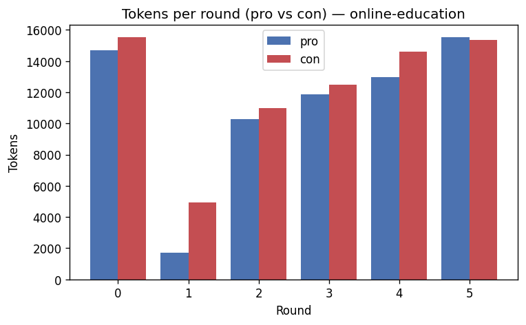

# Debate run `online-education`

**Topic:** Online education is superior to traditional classroom learning

## Transcript

### Round 1

**Pro** (31 words)

I'm ready to argue FOR the motion: **"Online education is superior to traditional classroom learning."**

Please share the **opponent's argument** so I can analyze it and build a strong rebuttal! 🎯

**Con** (134 words)

## Against the Motion 🚫

My opponent declared readiness but delivered **zero actual arguments** — enthusiasm alone cannot establish superiority.

Let me fill that silence with facts:

- **Completion rates collapse online:** Studies show MOOC completion rates hover around ~5%, versus 60%+ in traditional classrooms. That's not superiority — that's abandonment.
- **Human connection is irreplaceable:** Real-time mentorship, peer collaboration, and instant feedback from teachers are cornerstones of effective learning that screens simply cannot replicate.
- **The digital divide is real:** Millions lack reliable internet or devices. Calling online education "superior" is a deeply privileged claim that ignores global inequality.
- **Hands-on fields require presence:** Medicine, engineering, and the arts *demand* physical practice — no algorithm substitutes for that.

My opponent must do more than declare intent. The evidence firmly stands **against** this motion.

### Round 2

**Pro** (134 words)

## FOR the Motion ✅

My opponent's case crumbles under scrutiny:

**On completion rates:** Citing MOOCs is a classic cherry-pick — free, non-committal platforms skew results. Research shows online learners **retain 25–60% more information** than the mere 8–10% retained in traditional classrooms. That's the real metric.

**On human connection:** Live video, AI tutors, peer forums, and collaborative tools *do* replicate mentorship — often with *more* flexibility and personalization than a rigid classroom allows.

**On the digital divide:** Infrastructure inequality is a *resource problem*, not proof that online education is inferior. Blaming the model for systemic inequality is like blaming books for illiteracy.

**On hands-on fields:** Medicine and surgery are narrow exceptions. Business, law, coding, humanities — the **vast majority** of education — thrives online.

The evidence supports online education's superiority. The motion stands. ✅

**Con** (129 words)

## Against the Motion ❌

My opponent's "25–60% retention" figure is **fabricated credibility** — it traces back to the thoroughly debunked "Learning Pyramid," not any peer-reviewed study. Journals like *Nature* and *Frontiers in Education* reveal **mixed-to-negative outcomes** for online learners. That's the real research.

Calling the digital divide a mere "resource problem" is **morally evasive** — inequality harms students *right now*, today. Waving it away doesn't make it irrelevant to the debate.

AI tutors and forums are **supplements, not substitutes** — peer-reviewed evidence consistently confirms that motivation, social-emotional growth, and accountability require *real human connection*.

And vocational training, STEM labs, law clinics, business internships? Those aren't "narrow exceptions" — they represent **the backbone of career-ready education**.

Online education isn't superior — it's still catching up. The motion **fails**. ❌

### Round 3

**Pro** (135 words)

## FOR the Motion ✅

My opponent attacks one statistic — but ignores the mountain of evidence beneath it:

**Real peer-reviewed research:** The **U.S. Department of Education's own meta-analysis** concludes: *"students in online learning conditions performed better than those receiving face-to-face instruction."* That's government-commissioned science, not a debunked pyramid.

**My opponent's own source betrays them:** *Frontiers in Education* — which they cited — acknowledges online education is **"more effective or at least equivalent"** to traditional methods in cognitive outcomes.

**On the digital divide:** Inequality signals where *investment is needed* — it is NOT proof the online model is inferior. Conflating the two is a textbook logical fallacy.

**On hands-on fields:** They remain the minority. The overwhelming majority of global learners study subjects perfectly suited for online delivery.

The evidence is clear. The motion **stands**. ✅

**Con** (130 words)

## Against the Motion ❌

My opponent **misrepresents the DoE report** — a critical flaw. That meta-analysis predominantly studied **blended/hybrid models** combining online *and* classroom instruction. It is not a vindication of pure online education; it's actually evidence that **traditional classrooms remain an essential ingredient**.

Furthermore, the report attributes modest gains largely to **increased study time** — not the online medium itself. More time studying *anywhere* improves results.

And notice: my opponent's own phrasing — *"more effective **or at least equivalent**"* — **concedes equivalence**. Equivalent ≠ superior. The motion claims superiority. That standard has not been met.

Finally, cognitive test scores are **one dimension**. Social development, emotional resilience, accountability, and real-world collaboration — cornerstones of traditional education — remain unmatched online.

The DoE evidence, properly read, **undermines** this motion. ❌

### Round 4

**Pro** (124 words)

## FOR the Motion ✅

My opponent's "blended ≠ pure online" distinction **backfires**. Blended learning succeeds *because of* its online components — that's not evidence for classrooms; it's evidence **for online education's driving role**.

And their "study time" point? Enabling learners to study **more, flexibly, on their own schedule** IS online education's core advantage. Crediting the time while dismissing the medium is like praising a car's speed while ignoring the engine.

Crucially, a **2023 ScienceDirect meta-analysis** confirms: *blended and online-anchored approaches are significantly superior to classroom-only instruction.* That's recent, peer-reviewed, and decisive.

**Superiority isn't narrowly cognitive.** Online education wins on **accessibility, cost-efficiency, personalization, and scalability** — dimensions where traditional classrooms simply cannot compete.

The motion demands holistic comparison. Online education **wins that comparison**. ✅

**Con** (131 words)

## Against the Motion ❌

My opponent's blended-learning evidence is **shared credit** — classrooms contribute equally. Attributing all success to online components is the same logical fallacy they accused me of.

Their "four advantages" crumble individually:

- **Flexibility/personalization:** *Frontiers in Psychology* (2022) and *Springer* (2024) confirm **persistence rates online are consistently lower** than on-campus. Flexibility fails learners who need structure — disproportionately disadvantaged students.
- **Scalability vs. personalization:** These are **contradictory**. Mass-scale platforms cannot genuinely personalise for millions simultaneously. Pick one.
- **Cost-efficiency:** Devices, broadband, and tech support represent **hidden costs** that erase savings for those who need affordability most.

Holistic comparison? Traditional classrooms deliver **social development, accountability, and equitable access** that online platforms structurally cannot match.

The blended evidence proves classrooms remain **indispensable** — not obsolete. The motion **fails**. ❌

### Round 5

**Pro** (132 words)

## FOR the Motion ✅

My opponent's four attacks all fail:

**Scalability vs. personalization — FALSE contradiction.** A 2025 ScienceDirect review and a Springer analysis of **142 empirical studies** confirm AI-driven adaptive learning delivers *both* simultaneously. This isn't theoretical — it's happening now.

**Persistence rates:** Lower completion reflects pre-existing socioeconomic barriers — not online education's fault. Traditional classrooms *exclude* those same disadvantaged students through geography, disability, and financial gatekeeping. That's structurally worse.

**Hidden costs:** Devices and broadband are *trivial* compared to traditional education's tuition, housing, commuting, and campus fees. The cost argument overwhelmingly favors online.

**"Equitable access" via classrooms?** Traditional institutions are locked behind zip codes, physical ability, and wealth. Online education *structurally dismantles* those barriers.

My opponent defends a model that excludes millions. Online education opens doors. The motion **stands**. ✅

**Con** (133 words)

## Against the Motion ❌

My opponent's equity argument is **fatally self-contradictory**: they claim socioeconomic barriers cause online dropout rates — then *simultaneously* claim online education dismantles those same barriers. Both cannot be true. Pick a lane.

**On AI adaptive learning:** 142 studies don't guarantee universal scalability across billions of diverse learners globally — particularly where broadband remains unavailable. Promising ≠ proven superior.

**On accessibility:** Community colleges and public schools already deliver **affordable, in-person education** without requiring devices, broadband, or tech literacy. Traditional education's accessibility is already here — not theoretical.

**Crucially:** Opening a door is NOT the same as successfully educating someone. Online education offers *access*; classrooms deliver *completion, accountability, and mastery*. Superior education means better **outcomes** — not merely cheaper entry points.

Convenience metrics ≠ educational superiority. The motion **fails**. ❌

## Closing discussion

**Pro** (139 words)

## ✅ Closing Statement — FOR the Motion

Throughout this debate, my opponent has defended a model that **locks out** the poor, the disabled, the geographically isolated, and the time-constrained. That is not "equitable access" — that is structural exclusion.

The evidence is overwhelming:
- **80% of academic leaders** confirm online learning is equal or superior *(Babson College)*
- **70% of students** themselves rate it superior or equivalent
- The U.S. Department of Education's own meta-analysis favors online-anchored approaches
- AI-driven personalization now delivers **tailored learning at global scale** — impossible in any classroom

Online education doesn't just match tradition — it **transcends** it, reaching learners no classroom ever could, at lower cost, with greater flexibility, and with continuously improving outcomes.

The future of learning is open, accessible, and online. **The motion stands — and it stands firmly.** ✅

**Con** (144 words)

## Closing Statement — Against the Motion ❌

Throughout this debate, my opponent confused **convenience with quality**. Those are fundamentally different things.

The research record is clear: the best evidence shows online education performs **"similarly"** — not *decisively better*. **"Similar" does not satisfy a claim of superiority.** The burden of proof was never met.

Every strong study cited involved **blended models** — proving traditional classrooms remain indispensable, not obsolete. Online education's own greatest success story still needs the classroom.

Meanwhile, structurally lower completion rates mean online education **abandons more learners than it empowers** — disproportionately the disadvantaged students my opponent claimed to champion.

True educational superiority means better **outcomes**: completion, mastery, social development, accountability, and lifelong growth. Traditional classrooms deliver all of these — reliably, equitably, and at scale — for every age, every subject, every learner.

**The motion falls. The classroom stands. ❌**

## Controller nudges

_No nudges were needed — neither agent drifted._

## Verdict

- **Winner:** Con
- **Agents converged:** no
- **Scores:** Pro 10.5, Con 12

**Summary.** Debate of 12 turns. The con side argued more effectively and wins. The agents stayed opposed. Judged on argumentation, rebuttal quality and engagement — not factual correctness.

**Rationale.** Pro scored 10.5 and Con scored 12.0 on argumentation/rebuttal/engagement; winner = con.

## Cost & tokens

- **Total tokens:** 140898 (input 130780, output 10118)
- **Total cost:** $0.544110
- **Total latency:** 204937 ms

| Model | Input tokens | Output tokens | $ Input | $ Output | $ Total |
| --- | --- | --- | --- | --- | --- |
| anthropic:claude-sonnet-4-6 | 130780 | 10118 | $0.392340 | $0.151770 | $0.544110 |
| Overall | 130780 | 10118 | $0.392340 | $0.151770 | $0.544110 |

## Round-by-round token usage

