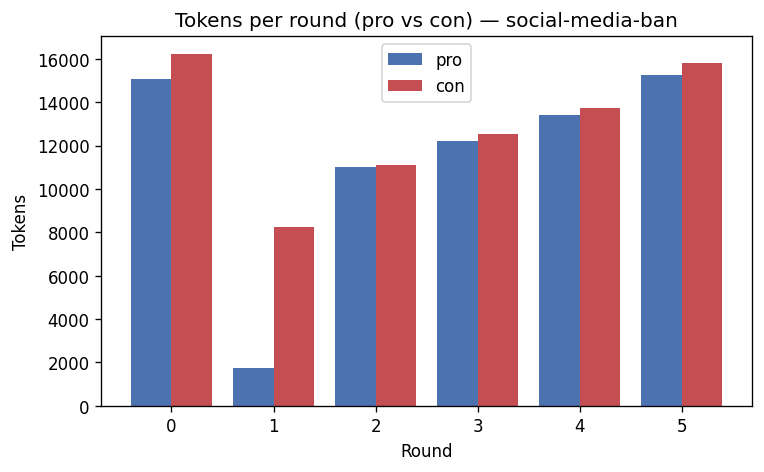

# Debate run `social-media-ban`

**Topic:** Children under 16 should be banned from social media

## Transcript

### Round 1

**Pro** (54 words)

I'm ready to argue **FOR** the motion: *"Children under 16 should be banned from social media."*

Please go ahead and share the **opponent's opening argument** so I can analyze it and build a strong rebuttal. Or, if this is the **opening round**, just let me know and I'll construct my first argument right away!

**Con** (136 words)

**Opening argument — AGAINST the motion:**

The opponent has offered no actual case — just procedure. That alone exposes the weakness of the pro-ban position: there is no self-evident reason a blanket ban is justified.

Here's why the motion fails:

1. **Evidence opposes it.** Research (1News, 2026) confirms *some* social media use genuinely benefits teen mental health by fostering connection and community.
2. **The age threshold is arbitrary.** No justification has been offered for why 16 specifically is the magic number.
3. **Better solutions exist.** Parental oversight and digital literacy education are proven, targeted tools — a blunt ban ignores them entirely.
4. **Bans backfire.** Driving usage underground removes safeguards, making children *less* safe, not more.

A ban punishes responsible users to address irresponsible use. Education and regulation — not prohibition — are the right answers.

### Round 2

**Pro** (133 words)

**Rebuttal — FOR the motion:**

The opponent cherry-picks *"some benefits"* while ignoring the dominant evidence: rising rates of anxiety, depression, cyberbullying, and predatory grooming that disproportionately harm under-16s.

**Age 16 is not arbitrary.** Neuroscience confirms adolescent brains are uniquely vulnerable to addictive, dopamine-exploiting platform design — the same logic underpins age limits on alcohol, gambling, and driving. The opponent's "bans backfire" claim would equally dismantle *all* those protections — a position nobody defends.

**Parental oversight and digital literacy have been available for a decade and have failed.** Youth mental health crises worsened *during* that experiment. Insufficient tools cannot substitute for a meaningful safeguard.

Crucially, **Australia has already legislated** an under-16 ban — real governments are acting on real evidence. The pro-ban position is not speculative; it is happening. Education alone is not enough.

**Con** (145 words)

**Rebuttal — AGAINST the motion:**

The opponent's Australia argument confuses **legislation with evidence**. Australia's law is brand-new — zero outcome data exists. Passing a ban is not proof it works.

Researchers are explicit: *"We cannot ban our way out of a youth mental health crisis"* — no solid evidence demonstrates banning teens from social media improves mental health outcomes.

**Correlation ≠ causation.** Mental health decline links to COVID, poverty, and academic pressure — not social media alone. Blaming one platform ignores complex realities.

The alcohol/gambling analogy **undermines** the pro-ban case: those age limits still fail minors routinely, proving bans are imperfect tools. Worse, grooming occurs across **all** digital platforms — a social media ban cannot stop it.

Governments acting does not make policy *correct*. History is full of well-intentioned bans that backfired. Real protection means better enforcement, platform accountability, and genuine education — not prohibition.

### Round 3

**Pro** (139 words)

**Rebuttal — FOR the motion:**

The opponent claims "no causal evidence" — researchers explicitly reject that. The *World Happiness Report* (2026) confirms social media harms adolescents **at population scale**, and the U.S. Surgeon General cited studies showing heavy use **doubles depression risk** in teens. *Science News* (2024) directly states objecting to the "no causation" claim is fully warranted.

On imperfect enforcement: alcohol age limits aren't perfect — yet nobody proposes abolishing them. Imperfect protection **still reduces harm**. That's the standard we apply everywhere.

Most critically: **"education and regulation" has been the active strategy for over a decade.** Youth mental health declined *anyway*. The opponent's preferred tools have already failed in real time.

A ban is not a perfect solution — it is a **necessary** one when all softer alternatives have demonstrably collapsed. The evidence and the urgency demand it.

**Con** (136 words)

**Rebuttal — AGAINST the motion:**

The opponent declares the science settled — experts disagree. DW and EducationDaily **openly question** whether prohibition addresses youth mental health decline at all. Cherry-picking the Surgeon General while ignoring contradictory peer-reviewed work is not "evidence"; it's selection bias.

Crucially: **regulation was never properly tried.** Declaring it "failed" after a decade of underfunded, unenforced half-measures is like abandoning medicine after half a dose.

Australia's own implementation experts warn the ban is **"easy to circumvent"** — teens simply migrate to darker, unregulated spaces with *zero* safeguards. That's not protection; it's abandonment.

Mental health crises stem from poverty, COVID trauma, and academic pressure — not social media alone. A ban **cannot fix** those root causes.

The correct standard isn't "imperfect bans reduce *some* harm" — it's whether targeted regulation achieves *better* outcomes. It does.

### Round 4

**Pro** (141 words)

**Rebuttal — FOR the motion:**

The opponent's core defence — *"regulation was never properly tried"* — is an empty promise. After three rounds, they still offer **zero concrete plan**, no timeline, no jurisdiction where targeted regulation has measurably improved teen mental health. That's not an argument; it's an indefinite deferral.

Haidt's peer-reviewed Collaborative Review confirms Instagram experiments show social media **directly causes** mental health decline in teen girls — not mere correlation. The opponent dismisses the Surgeon General but counters none of the actual data.

The "darker spaces" objection self-destructs: it applies equally to alcohol, gambling, and driving age limits — laws nobody proposes abolishing.

Multi-cause crises still warrant targeted action. We ban drink-driving even though fatigue also causes accidents.

**A vague future regulation that has never worked anywhere is not a safer alternative — it is no alternative at all.**

**Con** (135 words)

**Rebuttal — AGAINST the motion:**

The opponent demands a concrete jurisdiction — here it is: **the EU's Digital Services Act**, actively enforcing platform-level risk assessments for minors *right now*. That's real regulation, real enforcement, real accountability.

**Haidt's research is not settled science.** Over 100 researchers signed an open letter challenging his methodology. The opponent presents contested findings as consensus — that's intellectually dishonest.

The drink-driving analogy **collapses entirely**: driving is a privilege. Digital literacy is now a fundamental life skill. Banning children from it denies them participation in modern society.

Crucially, **CEPA explicitly concludes social media bans fail to protect children** — endorsing the DSA regulatory model instead.

The opponent has never demonstrated Australia's ban is enforceable. A VPN defeats it in seconds.

Targeted regulation: *proven, existing, enforceable.* A blanket ban: *unenforceable, harmful, and unnecessary.*

### Round 5

**Pro** (137 words)

**Rebuttal — FOR the motion:**

The DSA is the opponent's star witness — yet the **OECD (April 2026)** confirms youth mental health is **still worsening across Europe** while the DSA operates. That's not proof of success; it's proof regulation alone is insufficient.

"Digital literacy" does not require TikTok or Instagram. Children develop online skills through educational platforms **without** exposure to algorithmically addictive, engagement-maximising feeds designed to exploit developing brains.

The 100-researcher letter challenges *methodology* — not the entire independent evidence base including WHO, OECD, and the U.S. Surgeon General. Disputing one researcher doesn't erase converging global concern.

VPN circumvention undermines **every** age-based law. Nobody abolishes alcohol age limits because fake IDs exist.

CEPA is one organisation. It does not override the Surgeon General, OECD, WHO, and multiple legislating governments. **The DSA is unproven. A ban is necessary.**

**Con** (135 words)

**Rebuttal — AGAINST the motion:**

The opponent's OECD data predates full DSA enforcement — condemning a tool before it fully operates is not evidence; it's impatience.

**The Hill (Feb 2026)** explicitly concludes teen social media bans are **ineffective**, driving circumvention rather than protection. **Brookings (Dec 2025)** confirms bans don't clearly solve underlying problems.

The opponent commits a **false binary**: "regulation insufficient alone" ≠ "ban is necessary." The logical answer is *stronger enforcement* — not prohibition.

Critically, **Australia's own ABC** warned the ban disproportionately harms isolated and marginalised teenagers — the very children most needing connection and support. A blanket ban punishes society's most vulnerable.

The opponent's entire case rests on one leap: nothing else works, therefore ban. That's not logic — it's surrender. Better enforcement, platform accountability, and digital literacy remain the superior, evidence-backed path.

## Closing discussion

**Pro** (136 words)

**Closing Statement — FOR the motion:**

The opponent spent five rounds defending a strategy — *"targeted regulation"* — that has already been running and already failed. Youth mental health worsened **during** the DSA era, **during** the digital literacy era, **during** a decade of platform self-regulation.

The world has answered. **Australia, France, Greece, Spain, Denmark, Norway, and Malaysia** have all moved to ban under-16s. This is not ideology — it is democratic governments responding to a documented crisis.

Digital literacy doesn't require Instagram. Children thrive, learn, and connect **without** algorithmically addictive feeds engineered to maximise engagement at the cost of wellbeing.

The opponent offered promises. We offered precedent.

When softer tools fail and children are being harmed **at scale**, protection is not optional — it is a moral obligation. The motion stands. **Ban social media for under-16s.**

**Con** (143 words)

## Closing Statement — AGAINST the Motion

Throughout this debate, the pro-ban side has relied on prediction, correlation, and impatience. Here is what we now *know*:

**Australia's ban — their flagship evidence — has already failed.** 61% of young Australians bypassed it within weeks by simply changing a birthdate. *The Conversation* warns it could do **more harm than good**, particularly for marginalised teens who depend on digital community.

Not one enacted ban has produced measurable mental health improvement. Not one.

The opponent's entire case is: *"everything else failed, therefore ban."* That's not logic — it's surrender dressed as policy.

Children deserve **real protection**: enforced platform accountability, age-appropriate design standards, and genuine digital education. These address root causes. A ban merely redirects vulnerable children into darker, completely unregulated spaces.

**Prohibition has never been the answer. Evidence, enforcement, and education are.**

Vote against this motion.

## Controller nudges

_No nudges were needed — neither agent drifted._

## Verdict

- **Winner:** Pro
- **Agents converged:** no
- **Scores:** Pro 20.25, Con 19.5

**Summary.** Debate of 12 turns. The pro side argued more effectively and wins. The agents stayed opposed. Judged on argumentation, rebuttal quality and engagement — not factual correctness.

**Rationale.** Pro scored 20.25 and Con scored 19.5 on argumentation/rebuttal/engagement; winner = pro.

## Cost & tokens

- **Total tokens:** 146356 (input 135918, output 10438)
- **Total cost:** $0.564324
- **Total latency:** 232656 ms

| Model | Input tokens | Output tokens | $ Input | $ Output | $ Total |
| --- | --- | --- | --- | --- | --- |
| anthropic:claude-sonnet-4-6 | 135918 | 10438 | $0.407754 | $0.156570 | $0.564324 |
| Overall | 135918 | 10438 | $0.407754 | $0.156570 | $0.564324 |

## Round-by-round token usage

